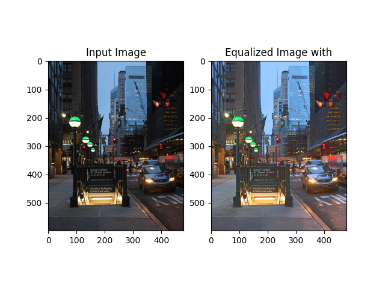
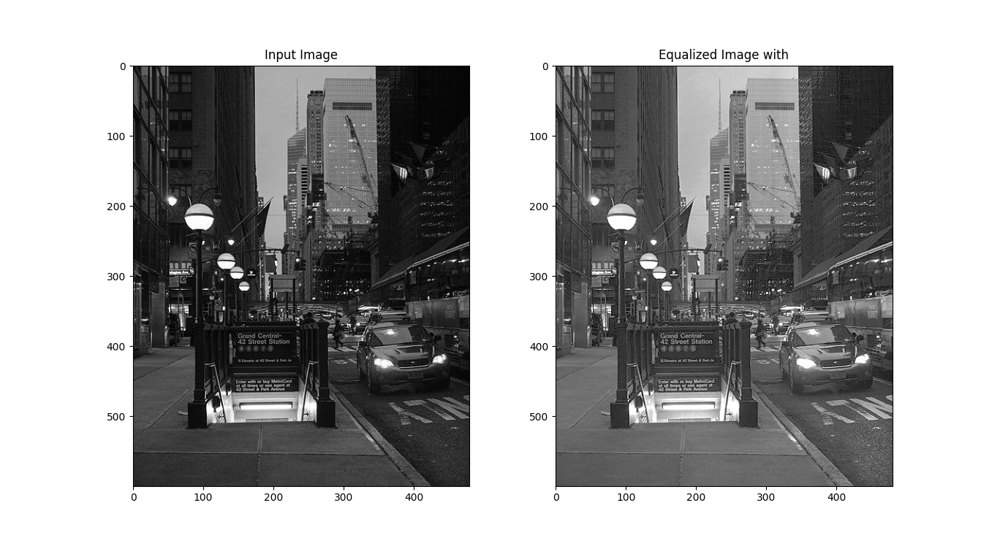

## Automatic Contrast-Limited Adaptive Histogram Equalization With Dual Gamma Correction

This is the implementation in python of the algorithm of the paper `Automatic Contrast-Limited Adaptive Histogram
Equalization With Dual Gamma Correction` [link here](https://ieeexplore.ieee.org/document/8269243). This is not an official repository. In the algorithm we use the HSV color space 
and specifically the V channel to equalize our images. The algorithm works with grayscale images as well. The proper selection of 
parameters is important in order to get a good result in RGB and Gray images. Before we process the image, we pad the image with the 
reflection. Reflection, reflects the columns and rows at the sides of the image. The rationale behind this approach, is that the blocks 
might not fit in the image properly. Thus, either we had to crop the image or pad and then return the original image size. The first approach could 
have affect our results. Vectorization methods were applied where possible. The algorithm spans across 2 double for loops, in the first one we process 
the image in blocks, where we calculate each block's histograms and all the necessary parameters. This loop instead of running it per pixel taking O(WxH) where 
W and H are the width and height of image respectively; it takes O(kxl) where kxl is the amount of fitted blocks per image dimension. The second step is the bilinear interpolation 
of pixels. Because we process the image per block, some pixels which rely on the boundaries of the blocks may have quite different values that create artifacts. To address this problem 
we apply bilinear interpolation where the value of each pixel is interpolated among the values of 4 blocks. 

## Prerequisites
Create your environment and install the dependencies required for this project.

```commandline
python3 -m venv env
source env/bin/activate
pip install pip --upgrade
pip install -r requirements.txt
```

To execute the algorithm run the `main.py` script. Running the main function with the -h flag 
you can get the list of arguments that you can pass to the main. You pass all the necessary arguments 
noted here in order to run the algorithm. 

``` 
usage: main.py [-h] [--kernel KERNEL] [--alpha ALPHA] [--delta DELTA] [--p P]
               [--show] [--out OUT]
               image

positional arguments:
  image            The image path

optional arguments:
  -h, --help       show this help message and exit
  --kernel KERNEL  Size of the kernel, if int then its (height, width)
  --alpha ALPHA    Alpha parameter of the algorithm
  --delta DELTA    The Delta threshold of the algorithm
  --p P            The factor for the computation of clip limits
  --show           Display the 2 figures with matplotlib, before and after
                   equalization
  --out OUT        Output directory of the equalized image. Default folder is
                   the ./images folder

```

## Running 

`python main.py ./images/streets_gray.jpg --kernel 32,32 --alpha 40 --delta 50 --p 1.5 --show`


`python main.py ./images/streets.jpg --kernel 32,32 --alpha 40 --delta 50 --p 1.5 --show`

`python main.py ./images/building.jpg --kernel 32,32 --alpha 40 --delta 50 --p 1.5 --show`

## Results

> RGB Example


> Grayscale Example

